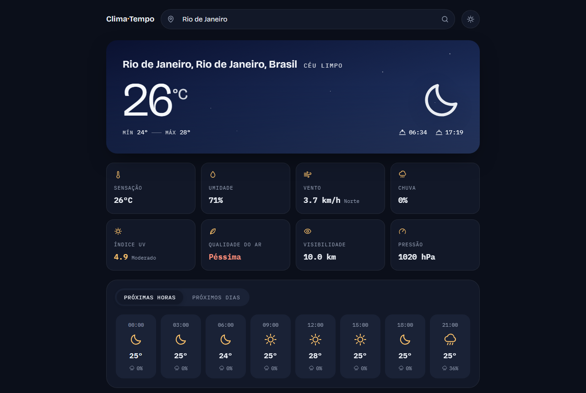
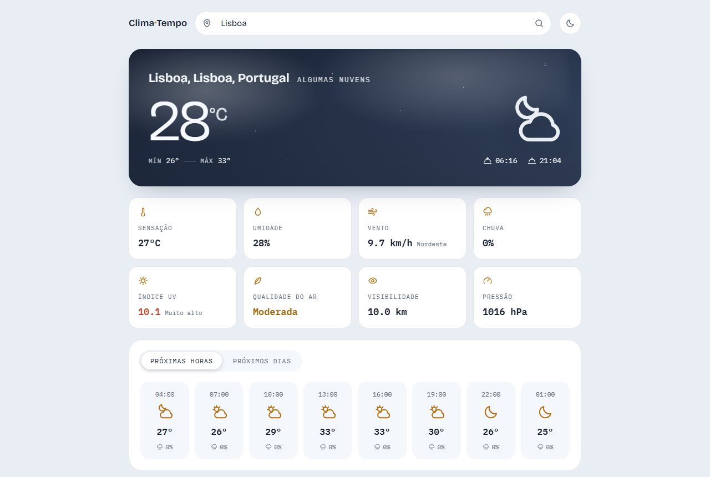
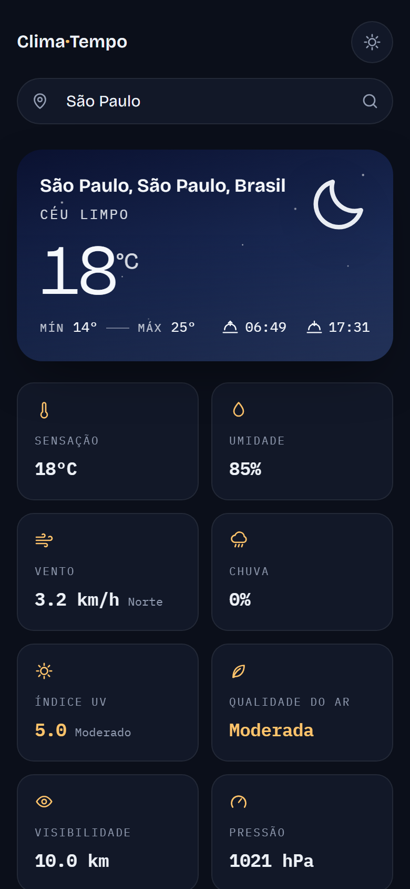
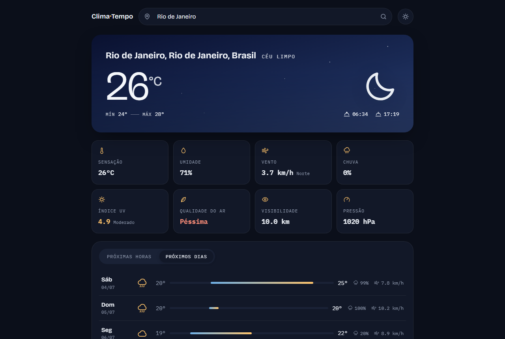
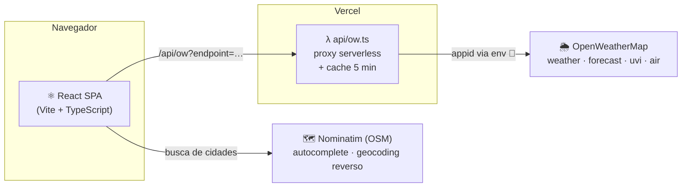

<div align="center">

# 🌦️ Clima·Tempo

**Previsão do tempo com um céu que reage às condições reais**

O painel principal muda de gradiente e ambiente — estrelas à noite, riscos de chuva,
nuvens à deriva, clarão de trovoada — conforme o clima da cidade consultada.

[](https://clima-tempo-one-beta.vercel.app)

[](https://react.dev)
[](https://www.typescriptlang.org)
[](https://vite.dev)
[](https://vercel.com)
[](LICENSE)

<br />



</div>

---

## ✨ Interface

| Tema claro | Mobile |
| :---: | :---: |
|  |  |

<div align="center">
  
  <p><em>Previsão diária com barra de faixa térmica comparativa entre os dias da semana</em></p>
</div>

## 🌡️ Funcionalidades

- **Clima atual** — temperatura, sensação térmica, mínima/máxima, nascer e pôr do sol no fuso local da cidade
- **8 indicadores** — umidade, vento com direção, probabilidade de chuva, índice UV, qualidade do ar, visibilidade e pressão, com cores de severidade
- **Previsão horária** — próximas 24 horas em intervalos de 3h, com probabilidade de chuva
- **Previsão diária** — próximos 5 dias com barra de faixa térmica comparativa
- **Busca com autocomplete** — sugestões de cidades do mundo todo via Nominatim (OpenStreetMap)
- **Geolocalização** — detecta a cidade do usuário na abertura
- **Tema claro/escuro** — persistente, respeitando `prefers-color-scheme`
- **Acessibilidade** — foco visível, rótulos ARIA e suporte a `prefers-reduced-motion`

### 🎨 O painel-céu

Cada condição climática tem seu próprio gradiente e camada de ambiente animada em CSS puro:

| Condição | Ambiente |
| --- | --- |
| ☀️ Céu limpo (dia) | Brilho solar pulsante |
| 🌙 Céu limpo (noite) | Campo de estrelas cintilantes |
| ☁️ Nublado | Massas de nuvens à deriva |
| 🌧️ Chuva | Riscos de chuva em queda |
| ⛈️ Trovoada | Chuva + clarões ocasionais |
| ❄️ Neve | Flocos caindo |
| 🌫️ Névoa | Bancos de neblina suaves |

## 🏗️ Arquitetura

A chave da API **nunca chega ao navegador**: o cliente fala apenas com um proxy serverless,
que injeta a chave a partir de variável de ambiente e valida endpoint e parâmetros.



Em desenvolvimento, o proxy do Vite ([vite.config.ts](vite.config.ts)) cumpre o mesmo papel
usando a chave do `.env` local — a mesma URL `/api/ow` funciona nos dois ambientes.

## 🧰 Stack

| Camada | Tecnologia |
| --- | --- |
| UI | React 19 + TypeScript estrito |
| Build | Vite 7 |
| Estilo | CSS moderno com design tokens — sem frameworks |
| Ícones | SVGs próprios (zero dependências de ícones) |
| Datas | `Intl`/`Date` nativos com offset de fuso da cidade |
| Dados | OpenWeatherMap + Nominatim |
| API segura | Vercel Serverless Function ([api/ow.ts](api/ow.ts)) |
| Hospedagem | Vercel, com deploy automático a cada push na `main` |

**Tipografia:** [Bricolage Grotesque](https://fonts.google.com/specimen/Bricolage+Grotesque) (display)
+ [IBM Plex Mono](https://fonts.google.com/specimen/IBM+Plex+Mono) (dados, com numerais tabulares).

## 🚀 Rodando localmente

> Pré-requisitos: Node.js 20+ e uma chave gratuita do [OpenWeatherMap](https://openweathermap.org/api).

```bash
# 1. Clone e instale
git clone https://github.com/cielioqueiroz/app-weather.git
cd app-weather
npm install

# 2. Configure a chave da API
cp .env.example .env
# edite .env e informe OPENWEATHER_API_KEY

# 3. Suba o servidor de desenvolvimento
npm run dev
```

| Script | Descrição |
| --- | --- |
| `npm run dev` | Servidor de desenvolvimento com HMR em `localhost:5173` |
| `npm run build` | Checagem de tipos (`tsc -b`) + build de produção |
| `npm run preview` | Serve o build de produção localmente |

## ☁️ Deploy

O projeto está conectado à Vercel — todo push na `main` gera um deploy de produção
e pushes em outras branches geram previews. Para um deploy manual:

```bash
vercel env add OPENWEATHER_API_KEY production   # uma única vez
vercel --prod
```

## 📁 Estrutura

```
api/
  ow.ts                  # proxy serverless do OpenWeatherMap
src/
  components/
    SkyPanel.tsx         # painel-céu animado (hero)
    StatGrid.tsx         # grade de indicadores
    Forecast.tsx         # previsão horária + diária
    SearchBar.tsx        # busca com autocomplete
    WeatherIcon.tsx      # glifos SVG por condição
  hooks/                 # useWeather, useTheme, useDebouncedValue
  lib/                   # cliente de API, formatação, mapeamento céu↔condição
  types/                 # tipos das respostas da API
  styles/global.css      # design tokens, temas e animações
```

## 📄 Licença

Distribuído sob a licença [MIT](LICENSE).

---

<div align="center">
  <sub>Dados meteorológicos de <a href="https://openweathermap.org">OpenWeatherMap</a> ·
  Geocoding de <a href="https://nominatim.org">Nominatim/OpenStreetMap</a></sub>
</div>
